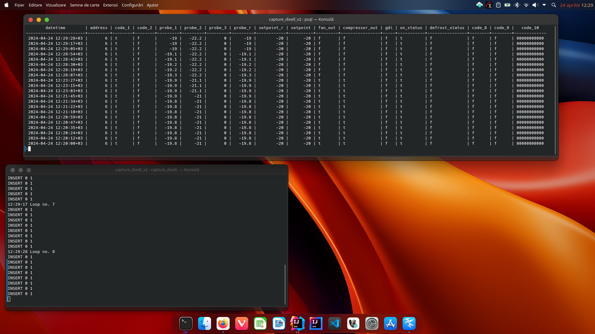

# Requesting monitoring parameters from Dixell XWEB300D

In version 1 it is using capture packets. For this I'm using sniffing program **tshark** and I capture the packages send by 
server to the client.  

In version 2 I used **curl** command to send the request data to server. For this also I'm using **tshark** to catch the POST data
to the server.
For this we need to catch the exact url address, cookie, content type and the data sent to the server with POST command by the client.  
  
Command used, in console terminal, to capture the package was next:  

```shell
tshark -V -i tun0 -Y "ip.addr==192.168.0.15 and http.request.line" -T fields -e http.request.full_uri -e http.cookie -e http.content_type -e http.file_data
```
and the result in my case was:  

```text
http://192.168.0.15/cgi-bin/runtime.cgi   user=Florin     application/x-www-form-urlencoded       NDVC=8&DEV_0=1|2|2857|3857|4857|8857|9857|18857|19857|20857|21857|24857|25857|17857|1|29857|30857|&DEV_1=1|3|2857|3857|4857|8857|9857|18857|19857|20857|21857|24857|25857|17857|1|29857|30857|&DEV_2=1|4|2857|3857|4857|8857|9857|18857|19857|20857|21857|24857|25857|17857|1|29857|30857|&DEV_3=1|5|2857|3857|4857|5857|6857|20857|29857|32857|23857|1|35857|36857|38857|&DEV_4=1|6|2858|3858|4858|5858|6858|20858|29858|32858|23858|1|35858|36858|38858|&DEV_5=1|7|2858|3858|4858|5858|6858|20858|29858|32858|23858|1|35858|36858|38858|&DEV_6=1|8|2858|3858|4858|5858|6858|20858|29858|32858|23858|1|35858|36858|38858|&DEV_7=1|9|2858|3858|4858|8858|9858|18858|19858|20858|21858|24858|25858|17858|1|29858|30858|\n
```  
Some examples how we can use the curl program exist to the address https://reqbin.com/req/c-sma2qrvp/curl-post-form-example  

With this information we construct the **curl** command to check if work: 

```shell
curl -X POST http://192.168.0.15/cgi-bin/runtime.cgi -H "Content-Type: application/x-www-form-urlencoded" -b "user=Florin" -d "NDVC=8&DEV_0=1|2|2857|3857|4857|8857|9857|18857|19857|20857|21857|24857|25857|17857|1|29857|30857|&DEV_1=1|3|2857|3857|4857|8857|9857|18857|19857|20857|21857|24857|25857|17857|1|29857|30857|&DEV_2=1|4|2857|3857|4857|8857|9857|18857|19857|20857|21857|24857|25857|17857|1|29857|30857|&DEV_3=1|5|2857|3857|4857|5857|6857|20857|29857|32857|23857|1|35857|36857|38857|&DEV_4=1|6|2858|3858|4858|5858|6858|20858|29858|32858|23858|1|35858|36858|38858|&DEV_5=1|7|2858|3858|4858|5858|6858|20858|29858|32858|23858|1|35858|36858|38858|&DEV_6=1|8|2858|3858|4858|5858|6858|20858|29858|32858|23858|1|35858|36858|38858|&DEV_7=1|9|2858|3858|4858|8858|9858|18858|19858|20858|21858|24858|25858|17858|1|29858|30858|"
```  
and the answer in my case was:  

```text
2|1|0|5.8|0|0|4.0|100.0|0|0|0|0|0|0|0|1|0|0|0000000000
3|1|0|5.5|0|0|4.0|100.0|0|0|0|0|0|0|0|1|0|0|0000000000
4|1|0|5.5|0|0|4.0|100.0|0|0|0|0|0|0|0|1|0|0|0000000000
5|0|0|13.2|15.0|0.0|13.2|-20.0|-20.0|0|0|0|0|0|0|0|00000000
6|1|0|-19.5|-22.1|0.0|-19.6|-20.0|-20.0|0|0|0|1|0|0|0|00000000000
7|0|0|12.5|14.1|0.0|12.5|-20.0|-20.0|0|0|0|0|0|0|0|00000000
8|1|0|7.0|5.7|0.0|7.0|6.0|6.0|1|0|0|1|0|0|0|00000000
9|0|0|12.7|0|0|4.0|100.0|0|0|0|0|0|0|0|0|0|0|0000000000
```
so it's work. We can construct a script to insert these parameters into tables from time series database TimescaleDB.  

  

The loop message it's for debug only, later I added a logging file for errors and may be for another usefully messages.
